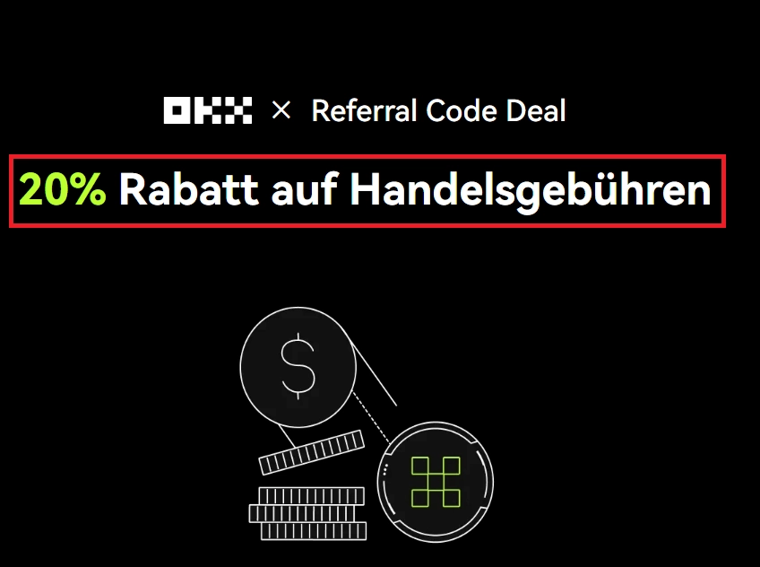
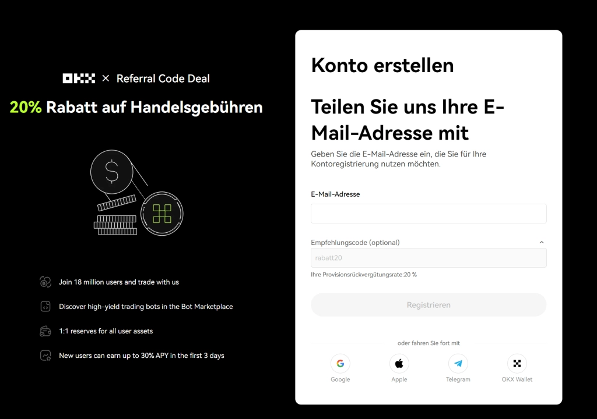
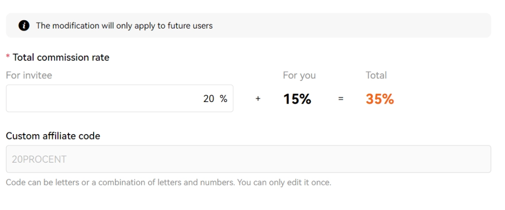

# OKX优惠码：终身享受20%手续费折扣

如果你在寻找一个交易手续费更低、支持多种支付方式的加密货币交易平台，OKX可能是个不错的选择。使用优惠码，你可以获得终身20%的手续费返现，这意味着每次交易后都能拿回一部分费用。对于频繁交易的用户来说，这笔长期累积下来的节省并不是小数目。

---

## 什么是OKX优惠码?

OKX优惠码其实就是一个推荐标识——用来记录是谁把你带到这个平台的。有意思的是,使用优惠码不仅仅是个形式,你能实打实地拿到好处。

输入优惠码**62834398**后,你的所有交易都能享受20%的手续费返现,而且是永久有效的。这个返现会在每次交易后自动发放到你的账户,虽然可能需要几个小时到账,但完全不需要你额外操作。

OKX是个体量相当大的国际交易平台,全球用户超过5000万,提供150多种加密货币交易对。在奥地利和瑞士市场,它的手续费是最低的那一档——标准费率已经只有0.1%,再加上优惠码的20%返现,实际成本就更低了。

## 如何使用优惠码?

使用优惠码的流程很简单,但有个关键点要注意:**必须在注册时就输入**,后期没法补填。

### 第一步:注册时填入优惠码

👉 [点击这里直达OKX注册页面并自动激活20%折扣](https://www.okx.com/join/62834398)

通过专属链接注册的好处是,你能在注册过程中就看到折扣确认信息。选择你所在的地区(比如奥地利或瑞士),同意条款后输入邮箱,然后点击"优惠码"栏位,填入**62834398**。

如果一切正常,你会看到系统提示:"您的佣金返还率:20%"。这个提示很重要——它证明优惠码已经生效。据观察,如果只是手动输入代码而不是通过专属链接,可能看不到这个确认提示。

### 第二步:充值资金

OKX支持多种充值方式:信用卡、银行转账、PayPal,或者直接转入你已有的加密货币。如果你已经持有加密货币,直接转账到平台钱包地址就行。如果想用欧元充值,几种主流支付方式都能用。

### 第三步:开始交易并享受折扣

资金到账后就可以交易了。20%的返现会自动生效,不需要你做任何额外设置。每笔交易完成后,返现会在几小时内自动到账。

## 20%手续费折扣怎么算?

OKX的基础费率本来就比较有竞争力——Market Taker订单收取0.1%,Market Maker订单也是0.1%。作为对比,Bybit和Bitvavo的Taker费率是0.25%。

这个20%返现的机制是这样的:平台会从交易手续费中拿出35%作为推荐佣金,而推荐方可以选择把最多20%分给用户。我们选择了把全部20%都返给用户——所以你每次交易后,都能拿回已付手续费的20%。

举个例子:你用1000欧元买入比特币,标准手续费是2.30欧元。使用优惠码后,你实际只需支付1.84欧元(因为会返还0.46欧元)。

另外,如果你的账户资产总值达到20,000欧元以上,或者30天交易量达到一定门槛,还能升级为VIP用户,获得更低的基础费率。这个VIP折扣和优惠码返现可以叠加使用。

## OKX限时活动:最高获得50欧元比特币

目前OKX正在进行一个推广活动,完成特定任务可以获得比特币奖励:

**交易奖励:**
- 交易满100欧元,获得20欧元比特币
- 交易满500欧元,额外获得5欧元比特币  
- 交易满5000欧元,额外获得10欧元比特币

**充值奖励:**
- 通过iDEAL充值1000欧元以上,获得5欧元比特币

## 为什么选择OKX?

OKX在CoinGecko的信任评分榜上排名第二(仅次于Bybit),属于头部交易平台。它的优势主要集中在这几个方面:

**主要优点:**
- 严格遵守各地监管规则,走合规路线
- 手续费非常低,最高只收0.10%,用上优惠码后更低
- 支持信用卡和银行转账等多种充值方式
- 是F1和曼城足球俱乐部的赞助商
- 提供去中心化的Web3钱包功能
- 公开储备证明(Proof of Reserves)
- 因为交易量大且用户遍布全球,所以流动性很好
- 界面对新手友好,同时也能满足高级交易者需求

**需要注意的点:**
- 2023年其DEX(去中心化交易所)部分遭遇过黑客攻击
- 没有电话客服
- 期货、期权和杠杆交易功能未开放
- OKB代币的折扣功能不可用(持有也没有额外优势)
- 币种数量相对较少,只有150种左右

<iframe width="560" height="315" src="https://www.youtube.com/embed/q05aVkioyLQ" frameborder="0" allowfullscreen></iframe>

---

## 总结

OKX是个运营成熟的大型交易平台,服务超过5000万用户。无论你是刚接触加密货币的新手,还是经验丰富的交易者,都能在这个平台上找到合适的功能。它选择走合规路线——等待各国监管批准后再正式开展业务,这种做法说明平台在考虑长期可持续发展。

手续费方面是OKX的强项:Market Taker和Market Maker的费率都只有0.1%,再加上使用优惠码**62834398**能享受的20%返现,实际成本相当有竞争力。如果你的交易量或持仓量达到VIP标准,还能获得更低的基础费率。

👉 [现在就注册OKX,激活20%手续费返现,开始更省钱的交易](https://www.okx.com/join/62834398)

要说不足的话,就是可交易的币种只有150种左右,对于想尝试各种小币种的用户来说可能有点限制。但如果你主要交易主流币种,OKX确实是个手续费低、操作稳定的选择。
